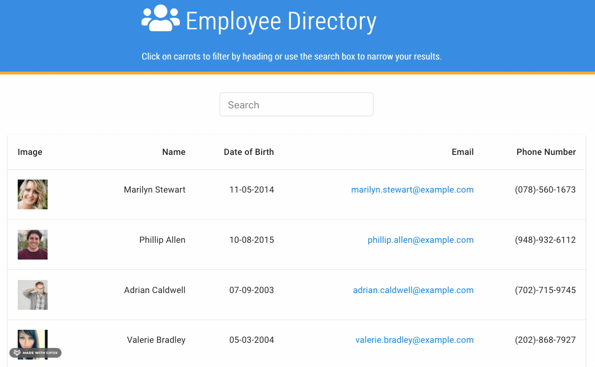

# react-employee-directory

## Description

https://rafaelrosas19.github.io/react-employee-directory/

The purpose of this application is to allow a user the ability to view an entire employee directory so they can quickly access an employee's information. 

## Installation

To use this repository you will need Node and React.

## Usage

To use the application simply type in the name of the employee that you are looking for into the search box. If there are no employs in the record with that name then you will see "Please try another user."

